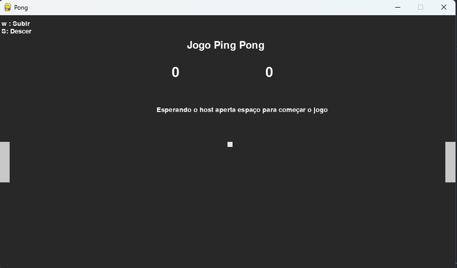

# Projeto de Redes
Projeto criado para a disciplina de Redes de computadores, criamos o jogo ping pong
## 👩‍💻 Grupo

|[Mateus Ferreira](https://github.com/mateussf99) , [Luiza Costa](https://github.com/luizacostam) , [Laura costa](https://github.com/Lauracostam) , [Ryan Barbalho](https://github.com/RyanBarbalho)

<h2 align="center"> Jogador 1/ Servidor </h2>
<p align="center"> 
  
</p>

<h2 align="center"> jogador 2/ Cliente </h2>
<p align="center">
  
</p>

## Passo para rodar a aplicação

Para executar este projeto, você precisará ter o Python instalado em sua máquina. Atraves do link https://www.python.org/downloads/ você consiguira baixar e instalr o python em sua maquina

Apos baixar o python você precisará instalar o pygame através do comando abaixo no terminal
```sh
  # Installing the dependencies
  pip install pygame
```
Clonando o repositorio do git
```sh
  # Clonando o repositório
  git clone https://github.com/mateussf99/projeto_de_redes
```
Comando para ir ao directory do clone do git
```sh
  # comando para ir ao directory
  cd projeto_de_redes 
```
Iniciando o servidor/ jogador 1
```sh
  # Iniciando o servidor/ jogador 1
  python servidor.py 
```
Iniciando o cliente/ jogador 2
```sh
  # Iniciando o cliente/ jogador 2
  python cliente.py 
```
Caso você queira testa em maquinas diferentes em mesma rede você precisara tocar o ip no cliente.py para o da maquina que ira roda o servidor 
```sh
  # Onde trocar o ip para o dos servidor
  self.ip = '127.0.0.1' #ip da maquina de destino 
``` 